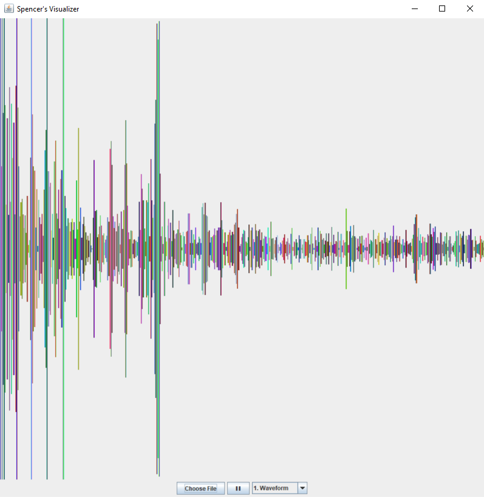

# Visualizer

## Overview
This music visualizer, written in Java, reads in audio samples from a sound file (WAV, AU, or AIFF/AIFF-C) and displays an animation based on the song's frequency spectrum while it plays. The UI allows the user to select audio files to display, toggle the playback of the file, and select different animation designs.

I designed the application using the Model-View-Controller pattern, where the model handles the calculation of the freqency data, the view takes care of displaying the animation and the user interface, and the controller runs the application and handles the user inputs.

Note that the functionality for reading the input file and extracting the audio samples from it (i.e. the `AudioSampleReader.java` file) was not written by me. I found that code on the Internet [here](http://web.archive.org/web/20120531113946/http://www.builogic.com/java/javasound-read-write.html).

## Usage
If you want to try the application for yourself, down the JAR file from [here](https://github.com/spencerlachance/visualizer/blob/master/Visualizer/Visualizer.jar) and run it!

## Developing
If you're not satisfied with my three default designs, feel free to clone the repo and write your own! The following steps are required to make it work:

1. Add a new file to the `designs` folder with your class and make it a child of the `VisualizerDesign` class.
2. Add a constructor that just calls the parent constructor.
3. Implement the `paintComponent()` method however you want! Just make sure to call `super.paintComponent(g)` first.
    - To get the array of frequency values for the current frame, call `vm.getFreqSpectrum()`.
4. Import your design class into `VisualizerView.java` and add entries for your design into:
    1. The `Design` `enum` at the top of the file
    2. The `DESIGN_OPTIONS` array field of the `VisualizerView` class
    3. The `switch` statement in the `selectDesign()` method